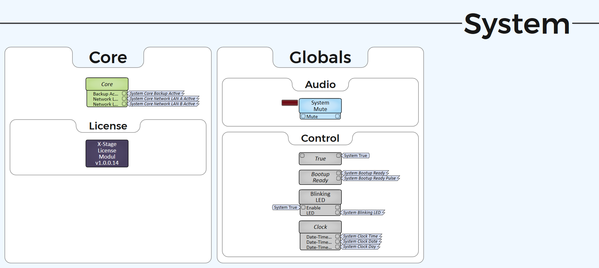

# Q-SYS Design Guidelines

## General

#### Language

All Q-SYS Design elements and scripts (see [Code Style Guidelines](q-sys-code-style-guidelines.md)) shall be written in English. This allows copy and paste of various Components between international projects.

## Naming



There are different main page groups, that all have different specific purposes. Each Group may be connected to a group specific type from the following table. This allows you to build granularity within the design.

<table><thead><tr><th width="118">Group</th><th width="333">Group Specific Type (Optional)</th><th>Associated functionalities</th></tr></thead><tbody><tr><td>UI</td><td>UCI, <a data-footnote-ref href="#user-content-fn-1">XK</a>, <a data-footnote-ref href="#user-content-fn-2">VC</a>, Wallpanels</td><td>UCI interfaces, XK-Keypanels and other control interfaces</td></tr><tr><td>Video</td><td><a data-footnote-ref href="#user-content-fn-3">BMD</a>, <a data-footnote-ref href="#user-content-fn-4">MN</a>, Cameras, Displays, Recording</td><td>Video routers, cameras, displays</td></tr><tr><td>Audio</td><td><a data-footnote-ref href="#user-content-fn-5">Show Relay</a>, Recording</td><td>Audio mixers, amps, audio device control, audio test tools</td></tr><tr><td>Cuelights</td><td></td><td>Cuelight connectors, cuelight logics</td></tr><tr><td>System</td><td></td><td>Licensing, global default controls, system mute, status readout</td></tr></tbody></table>

For constructing specific Schematic Page names, the following table shall be used for orientation. The naming convention for Schematic Pages is **Title Case**.

<mark style="color:blue;">**Group**</mark>**&#x20;+&#x20;**<mark style="color:purple;">**Group Specific Type (Optional)**</mark>**&#x20;+&#x20;**<mark style="color:orange;">**Stage (Optional)**</mark>**&#x20;+&#x20;**<mark style="color:red;">**Location (Optional)**</mark>

| Group (+ Group Specific Type) | Stage (Optional) | Location (Optional) |
| ----------------------------- | ---------------- | ------------------- |
| UI                            | KH[^6]           | Desk[^7]            |
| Video                         | GH[^8]           | FoH[^9]             |
| Audio                         | WB[^10]          | Studio              |
| Cuelights                     |                  | SW[^11]             |
| System                        |                  |                     |

#### **Examples**

* <mark style="color:blue;">Audio</mark> <mark style="color:orange;">GH</mark> <mark style="color:red;">Desk</mark>
  * Audio processing for the stage managers desk of the large stage (Großes Haus).
* <mark style="color:blue;">UI</mark> <mark style="color:purple;">UCI</mark> <mark style="color:orange;">KH</mark> <mark style="color:red;">Desk</mark>
  * UCI for the stage managers desk of the small stage (Kleines Haus).
* <mark style="color:blue;">UI</mark> <mark style="color:purple;">XK</mark> <mark style="color:orange;">KH</mark> <mark style="color:red;">Desk</mark>
  * XK Keypanel for the stage managers desk of the small stage (Kleines Haus).
* <mark style="color:blue;">Video</mark> <mark style="color:purple;">BMD</mark>
  * BMD video switching for the entire venue (not specific to a stage).
* <mark style="color:blue;">System</mark>
  * All components associated with the core and global controls.



The Components (Script Access) names follow the name of their schematic pages + their functional name. If multiple Components with the same functional names exist, they should be named after their location or if that's not possible, numbered consecutively.

The naming convention for the script access Component names shall be **Title Case**.

<mark style="color:blue;">**Schematic Page Name**</mark> + <mark style="color:purple;">**Functional Name**</mark> + <mark style="color:orange;">**Number/Location (Optional)**</mark>

#### **Examples**

* <mark style="color:blue;">Audio Show Relay WB</mark> <mark style="color:purple;">Mixer</mark>
  * Mixer Component for the show relay of the workshop stage (Werkstattbühne).
* <mark style="color:blue;">UI KH Desk</mark> <mark style="color:purple;">User Management</mark>
  * User Management Plugin for the stage managers desk of the small stage (Kleines Haus).
* <mark style="color:blue;">Video MN</mark> <mark style="color:purple;">Hi-App</mark>
  * Hi-App Plugin for MediorNet video control.
* <mark style="color:blue;">System</mark> <mark style="color:purple;">Status Core-Main</mark>
  * Status Component for the Main-Core.



As flag names are unique to one output pin (one output to multiple inputs), their names are associated with the Component, that outputs the signal.

The naming should thereby follow the names of their output Components script name + the name of the Components control.

The naming convention for the flag names shall be **Title Case**.

<mark style="color:blue;">**Component Name**</mark> + <mark style="color:purple;">**Control Name**</mark>

#### **Examples**

* <mark style="color:blue;">Audio Rehearsal System Mixer</mark> <mark style="color:purple;">Input 1 Gain</mark>
  * Input 1 Gain control output of the mixer from the audio rehearsal system.
* <mark style="color:blue;">UI KH Desk XK</mark> <mark style="color:purple;">Button Tast 10</mark>
  * Tast Button 10 control output of the XK (XK-Flex) keypanel plugin from the small stage (Kleines Haus).



## Page Layout

All texts from Graphic Tools (Schematic Elements -> Graphic Tools) shall be written in the font face Montserrat.

<figure><picture><source srcset="../.gitbook/assets/qsys_example_page_layout_dark.png" media="(prefers-color-scheme: dark)"></picture><figcaption></figcaption></figure>

### Header

Each Schematic Page has to include a Header, that has the following parameters:

* Text: \[Schematic Page Name]
* Position: 0,0 (x,y)
* Size: 2000,90 (width, height)
* Fill (Text Color): #171717
* Font: 56px, Montserrat, Medium

### Group Boxes

All Components must be fitted inside a Group Box. These act as "containers" that separate content on a Schematic Page and allow separation between different system parts/Components.

There are two different types of Group Boxes: Normal and Nested.\
Nested Group Boxes are only used for nested "containers" inside Normal Group Boxes. They can be helpful, to further differentiate different Components.


For Nested Group Boxes, only the Font Size changes from 32px to 20px.


#### Normal

* Text: \[Container Description]
* Position: x,x (x,y) -> dependent on available space on the schematic page
* Size: x,x (width, height) -> dependent on use case and content
* Fill: #ffffff
* Corner Radius: 12
* Stroke Color: #8d8d8d
* Stroke Width: 1px
* Text Color: #171717
* Font: 32px, Montserrat, Medium

#### Nested

* Text: \[Container Description]
* Position: x,x (x,y) -> dependent on available space on the schematic page
* Size: x,x (width, height) -> dependent on use case and content
* Fill: #ffffff
* Corner Radius: 12
* Stroke Color: #8d8d8d
* Stroke Width: 1px
* Text Color: #171717
* Font: 20px, Montserrat, Medium

[^1]: XK-Keypanels

[^2]: VisualCues

[^3]: Blackmagic Design (Videohub)

[^4]: Riedel MediorNet

[^5]: DE: "Mithören"

[^6]: Small stage\
    DE: "Großes Haus"

[^7]: Stage managers desk

[^8]: Large stage\
    DE: "Großes Haus"

[^9]: Front of House

[^10]: Workshop stage\
    DE: "Werkstattbühne"

[^11]: Lighting desk\
    DE: "Stellwerk"
